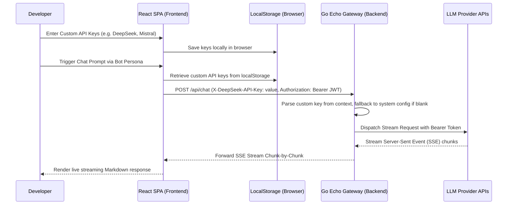

# Technical Specification & System Architecture: AI Mini Prompt Router

This document serves as the formal specification and comprehensive architecture guide for the **AI Mini Prompt Router** project. It details the system design, database schemas, HTTP contracts, and zero-trust API credential workflows.

---

## 1. System Architecture

The AI Mini Prompt Router is built using a decoupled, client-server model consisting of a **React Single Page Application (SPA)** frontend and a **Go (Golang) REST Gateway** backend, backed by **MongoDB** for transactional logging and persona tenancy.

### Complete Architecture Blueprint
```mermaid
graph TD
    subgraph Frontend Client (React + TS + Tailwind)
        A[Dashboard Layout] --> B[Sidebar / Collapsible Nav]
        A --> C[Chat Dashboard]
        A --> D[Bots/Assistants Management]
        A --> E[Analytics Dashboard]
        F[API Credentials Portal] -->|Browser LocalStorage| A
    end

    subgraph Go Gateway (Echo HTTP Framework)
        G[CORS/Logger Middleware] --> H[JWT Auth Middleware]
        H --> I[Auth Controller]
        H --> J[Bot CRUD Controller]
        H --> K[Chat Controller]
        H --> L[Dashboard Stats Controller]
        
        K --> M[LLM Router Factory]
        M --> N1[OpenAI Adapter]
        M --> N2[Anthropic Adapter]
        M --> N3[Gemini Adapter]
        M --> N4[Groq Adapter]
        M --> N5[OpenAI-Compatible Adapter]
    end

    subgraph Database Layer
        I --> DB[(MongoDB Database)]
        J --> DB
        L --> DB
        K -->|Log Token Usage| DB
    end

    subgraph External LLM Providers
        N1 --> P1[OpenAI API]
        N2 --> P2[Anthropic API]
        N3 --> P3[Google Gemini API]
        N4 --> P4[Groq API]
        N5 --> P5[DeepSeek / Mistral / xAI / Meta]
    end
```

---

## 2. API Key Delivery and Zero-Trust Workflow

To eliminate database security liabilities, developer API credentials are never transmitted to be stored on the database server. Instead, a local-first, zero-trust workflow is utilized:

1. **Client-side Storage**: Credentials for all 8 providers (**OpenAI, Anthropic, Gemini, Groq, DeepSeek, Mistral, xAI, Meta**) are saved directly into the user's browser `localStorage` inside the custom settings portal.
2. **Context-Injected Headers**: During prompt submission, the frontend intercepts the request and appends custom headers containing the client-provided keys:
   * `X-OpenAI-API-Key`
   * `X-Anthropic-API-Key`
   * `X-Gemini-API-Key`
   * `X-Groq-API-Key`
   * `X-DeepSeek-API-Key`
   * `X-Mistral-API-Key`
   * `X-xAI-API-Key`
   * `X-Meta-API-Key`
3. **Backend Key Evaluation**: 
   * The backend extracts headers into a request-scoped `context.Context`.
   * The router evaluates the custom key.
   * If a custom header is absent, the backend falls back to the system environment variables (`.env`) for shared tenant keys.
   * If neither is present, it returns an explicit error stream chunk.

### Credential Delivery Sequence


---

## 3. Database Schema Specification (MongoDB)

The data storage system leverages MongoDB with three main collection definitions.

### 3.1. `users` Collection
Stores stateless account profiles for tenants.

```json
{
  "_id": "ObjectId",
  "name": "string",
  "email": "string (unique index)",
  "password": "string (bcrypt hash)",
  "created_at": "ISODate"
}
```

### 3.2. `bots` Collection
Defines specialized assistant personas, including fine-grained hyperparameter configurations.

```json
{
  "_id": "ObjectId",
  "user_id": "ObjectId (indexed)",
  "name": "string",
  "description": "string",
  "provider": "string (OpenAI | Anthropic | Gemini | Groq | DeepSeek | Mistral | xAI | Meta)",
  "model": "string",
  "system_prompt": "string",
  "temperature": "double (optional, 0.0 to 2.0)",
  "max_tokens": "int (optional)",
  "top_p": "double (optional)",
  "top_k": "int (optional)",
  "presence_penalty": "double (optional)",
  "frequency_penalty": "double (optional)",
  "created_at": "ISODate",
  "updated_at": "ISODate"
}
```

### 3.3. `usage_logs` Collection
A transactional ledger recording AI generation statistics for real-time cost-saving analytics.

```json
{
  "_id": "ObjectId",
  "user_id": "ObjectId (indexed)",
  "bot_id": "ObjectId",
  "bot_name": "string",
  "provider": "string",
  "model": "string",
  "tokens_used": "int",
  "created_at": "ISODate"
}
```

---

## 4. API Endpoints Reference

All routes are prefixed by `/api`.

### 4.1. Authentication Router
| Method | Path | Authentication | Description | Request Payload | Response Payload |
| :--- | :--- | :--- | :--- | :--- | :--- |
| **POST** | `/auth/signup` | Public | Registers a new developer tenant account | `SignupRequest` | `AuthResponse` |
| **POST** | `/auth/login` | Public | Verifies credentials and issues a JWT token | `LoginRequest` | `AuthResponse` |
| **GET** | `/auth/me` | Protected (`Bearer JWT`) | Retrieves current active session profile | *None* | `User` |

### 4.2. AI Bots/Assistants Router
| Method | Path | Authentication | Description | Request Payload | Response Payload |
| :--- | :--- | :--- | :--- | :--- | :--- |
| **POST** | `/bots` | Protected (`Bearer JWT`) | Creates a new custom assistant persona | `BotCreateRequest` | `Bot` |
| **GET** | `/bots` | Protected (`Bearer JWT`) | Lists all custom personas for the tenant | *None* | `[]Bot` |
| **GET** | `/bots/models` | Protected (`Bearer JWT`) | Returns support dropdown map of models | *None* | `map[string][]ModelOption` |
| **GET** | `/bots/:id` | Protected (`Bearer JWT`) | Fetches a single bot's specifications | *None* | `Bot` |
| **PATCH** | `/bots/:id` | Protected (`Bearer JWT`) | Updates bot hyperparameter details | `BotUpdateRequest` | `Bot` |
| **DELETE** | `/bots/:id` | Protected (`Bearer JWT`) | Deletes an assistant persona permanently | *None* | `{"message": "success"}` |

### 4.3. Real-Time Chat & Streaming Router
| Method | Path | Authentication | Description | Request Payload | Response Payload |
| :--- | :--- | :--- | :--- | :--- | :--- |
| **POST** | `/chat` | Protected (`Bearer JWT`) | Streams assistant response via SSE | `ChatRequest` | `EventStream (SSE)` |

#### SSE Event Protocol Lifecycle
1. **Connection Established**: Client triggers a `POST /api/chat` request with appropriate provider API key headers.
2. **Response Header Configuration**:
   ```http
   Content-Type: text/event-stream
   Cache-Control: no-cache
   Connection: keep-alive
   ```
3. **Data Stream Delivery**: 
   Chunks are delivered continuously as marshaled JSON payloads:
   ```json
   data: {"token": "Hello"}
   data: {"token": " world"}
   ```
4. **Error Handling Stream** (If failure occurs, a styled inline error block is piped):
   ```json
   data: {"error": "DeepSeek API key is missing or not configured."}
   ```
5. **Metadata Payload**:
   ```json
   data: {"metadata": {"provider": "DeepSeek", "model": "deepseek-chat", "tokens_used": 152}}
   ```
6. **Closing Sentinel**:
   ```text
   data: [DONE]
   ```

### 4.4. Dashboard Analytics Router
| Method | Path | Authentication | Description | Request Payload | Response Payload |
| :--- | :--- | :--- | :--- | :--- | :--- |
| **GET** | `/usage/summary` | Protected (`Bearer JWT`) | Aggregated token ledgers and logs | *None* | `UsageSummary` |
| **GET** | `/dashboard/stats` | Protected (`Bearer JWT`) | Unified analytics metrics portal (alias) | *None* | `UsageSummary` |

---

## 5. Frontend & UI Architecture

The React client implements a high-fidelity dark/light mode dashboard designed around component modularity.

### 5.1. Global Context Providers
* **`ThemeProvider`**: Governs current active theme state (`light` | `dark`), applying custom styled CSS variable tokens to `:root` to animate transition shifts dynamically.
* **`AuthProvider`**: Manages authorization states, handles session handshakes via localStorage JWT retention, and intercepts unauthorized API failures.

### 5.2. Premium Layout Configuration
* **`DashboardLayout`**: Manages the screen shell, governs the collapsible desktop navigation column (`72px` to `260px` transitions), and maintains mobile responsive slides using framer-motion backdrops.
* **`Sidebar`**: Built with Spring-based animated dimensions. Features inline icon hover tooltips, route active capsules via `layoutId="activePill"`, collapsible bot drawers, and settings access triggers.
* **`ApiCredentialsModal`**: Redesigned as an immersive glassmorphic settings layout. Leverages a **React Portal** to mount globally directly under `document.body`, escaping context-transform restrictions of sidebar containers for absolute screen centering.

---

## 6. LLM Routing & Provider Integrations

The backend adapter structure maps incoming routing requests utilizing a strict Factory Pattern.

```go
type LLMProvider interface {
	GenerateCompletion(ctx context.Context, model string, systemPrompt string, userPrompt string, opts *GeneratorOptions) (*ChatResponse, error)
	GenerateCompletionStream(ctx context.Context, model string, systemPrompt string, userPrompt string, chunkChan chan<- string, opts *GeneratorOptions) (*ChatResponse, error)
}
```

### Supported Provider Mapping Profiles

| Provider ID | Provider Brand | Supported Core Models | REST API Gateway Base URL | Custom Request Header |
| :--- | :--- | :--- | :--- | :--- |
| `openai` | OpenAI | `gpt-4o`, `gpt-4-turbo`, `gpt-3.5-turbo` | `https://api.openai.com/v1` | `X-OpenAI-API-Key` |
| `anthropic` | Anthropic | `claude-3-5-sonnet-latest`, `claude-3-opus-latest`, `claude-3-haiku-20240307` | `https://api.anthropic.com` | `X-Anthropic-API-Key` |
| `gemini` | Google Gemini | `gemini-2.5-flash`, `gemini-2.5-pro` | Direct Native Client SDK | `X-Gemini-API-Key` |
| `groq` | Groq | `llama-3.3-70b-versatile`, `mixtral-8x7b-32768` | `https://api.groq.com/openai/v1` | `X-Groq-API-Key` |
| `meta` | Meta (Groq Gateway) | `llama-3.3-70b-specdec`, `llama-3-8b-8192` | `https://api.groq.com/openai/v1` | `X-Meta-API-Key` |
| `mistral` | Mistral | `mistral-large-latest`, `open-mixtral-8x22b` | `https://api.mistral.ai/v1` | `X-Mistral-API-Key` |
| `deepseek` | DeepSeek | `deepseek-chat`, `deepseek-reasoner` | `https://api.deepseek.com` | `X-DeepSeek-API-Key` |
| `xai` | xAI | `grok-2-1212`, `grok-beta` | `https://api.x.ai/v1` | `X-xAI-API-Key` |

---

## 7. Configuration Specifications

### Backend System Variables (`.env`)
```env
PORT=8081
MONGO_URI=mongodb://localhost:27017/prompt_router
JWT_SECRET=your_super_secret_jwt_key
OPENAI_API_KEY=your_shared_openai_key_here
GEMINI_API_KEY=your_shared_gemini_key_here
GROQ_API_KEY=your_shared_groq_key_here
# Optional fallbacks for compatible platforms
DEEPSEEK_API_KEY=your_shared_deepseek_key_here
MISTRAL_API_KEY=your_shared_mistral_key_here
XAI_API_KEY=your_shared_xai_key_here
```

### Custom Request Header Extraction Flow
```go
// Extracted inside controller/chat/handler.go
ctx = context.WithValue(ctx, "X-OpenAI-API-Key", c.Request().Header.Get("X-OpenAI-API-Key"))
ctx = context.WithValue(ctx, "X-Anthropic-API-Key", c.Request().Header.Get("X-Anthropic-API-Key"))
ctx = context.WithValue(ctx, "X-Gemini-API-Key", c.Request().Header.Get("X-Gemini-API-Key"))
ctx = context.WithValue(ctx, "X-Groq-API-Key", c.Request().Header.Get("X-Groq-API-Key"))
ctx = context.WithValue(ctx, "X-DeepSeek-API-Key", c.Request().Header.Get("X-DeepSeek-API-Key"))
ctx = context.WithValue(ctx, "X-Mistral-API-Key", c.Request().Header.Get("X-Mistral-API-Key"))
ctx = context.WithValue(ctx, "X-xAI-API-Key", c.Request().Header.Get("X-xAI-API-Key"))
ctx = context.WithValue(ctx, "X-Meta-API-Key", c.Request().Header.Get("X-Meta-API-Key"))
```
